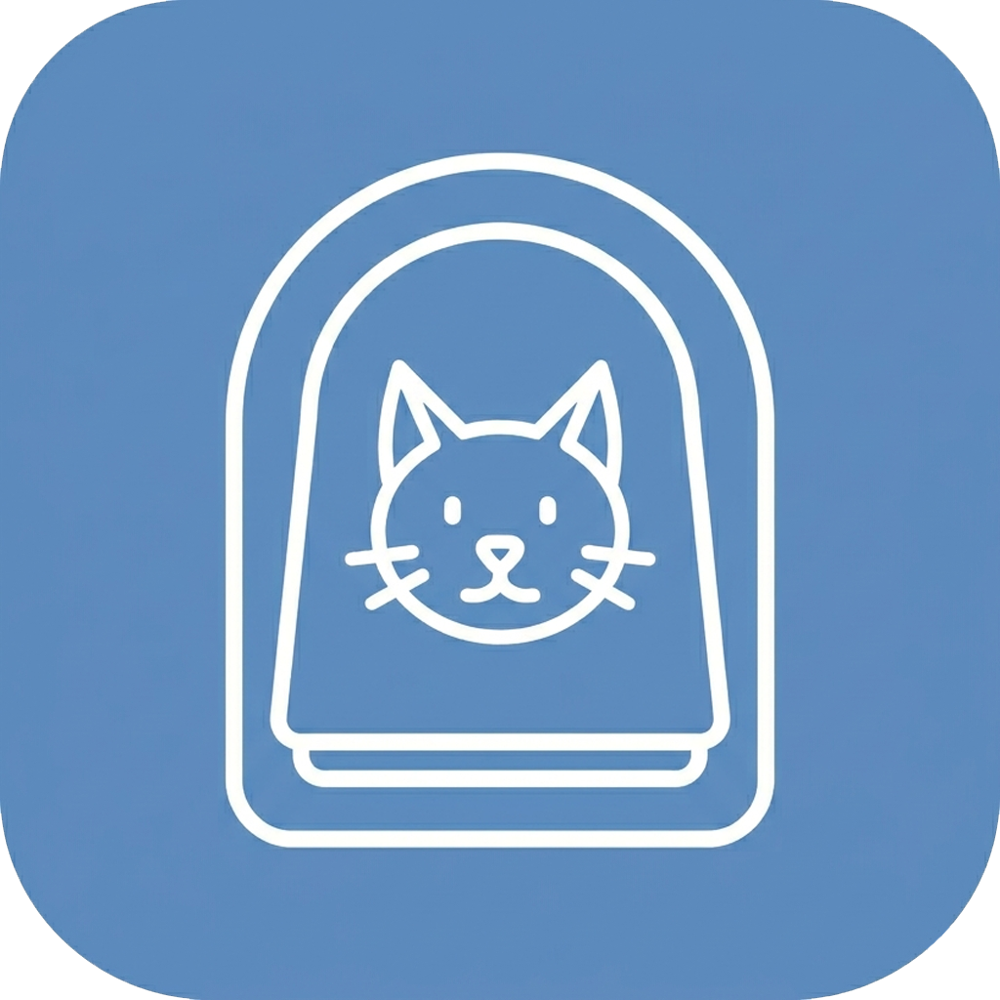
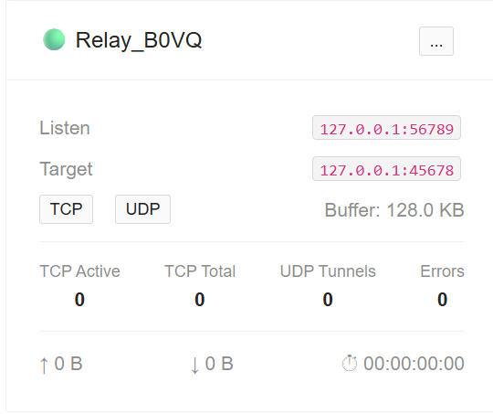

<div align="center">

# 🐱 Cat Flap Relay

<div align="center">
  
</div>

**基于 .NET 10 构建的现代高性能 TCP/UDP 端口转发工具包**

[](LICENSE)
[](https://dotnet.microsoft.com/)
[](https://www.nuget.org/packages/CatFlapRelay/)
[](https://www.nuget.org/packages/CatFlapRelay/)
[](https://hub.docker.com/r/kingsznhone/catflap-relay)
[](https://hub.docker.com/r/kingsznhone/catflap-relay)
[]()

**[English](./README.md) | 简体中文**

</div>

---

Cat Flap Relay 是一个双栈（IPv4 & IPv6）端口转发工具包，包含两个组件：

| 组件 | 使用场景 |
|------|----------|
| **CatFlapRelay.CLI** | 轻量级命令行工具 — 秒级启动 TCP/UDP 转发 |
| **CatFlapRelay.Panel** | 功能完整的管理面板（Blazor + REST API）— 通过浏览器或 API 管理多个转发规则，支持 Docker 部署 |

---

## NuGet 库

核心转发引擎以独立 NuGet 包的形式提供，可嵌入到您自己的 .NET 应用中。

```bash
dotnet add package CatFlapRelay
```

或通过包管理器控制台：

```powershell
Install-Package CatFlapRelay
```

### 使用方式

#### 第一步 — 选择日志记录器

两种 API 均接受任意 `ILoggerFactory`，按需选用：

```csharp
using Microsoft.Extensions.Logging;
using Microsoft.Extensions.Logging.Abstractions;

// 无日志（静默）— 零依赖
ILoggerFactory loggerFactory = NullLoggerFactory.Instance;

// 内置控制台日志 — 无需额外包
ILoggerFactory loggerFactory = LoggerFactory.Create(b => b.AddConsole());

// Serilog — 安装 Serilog.Extensions.Logging 及所需 Sink
var serilog = new LoggerConfiguration()
    .MinimumLevel.Information()
    .WriteTo.Console()
    .CreateLogger();
ILoggerFactory loggerFactory = LoggerFactory.Create(b => b.AddSerilog(serilog));

// ASP.NET Core / Generic Host — 从 DI 容器中解析
// ILoggerFactory loggerFactory = app.Services.GetRequiredService<ILoggerFactory>();
```

#### 第二步 A — 通过 `FlapRelayOption` 直接实例化

```csharp
using CatFlapRelay;

var factory = new FlapRelayFactory(loggerFactory);

var relay = factory.CreateRelay(new FlapRelayOption
{
    Name       = "MyRelay",
    ListenHost = "0.0.0.0:8080",
    TargetHost = "192.168.1.100:3389",
    TCP        = true,
    UDP        = true,
    BufferSize = 131072,
});

await relay.StartAsync();

// ...

await relay.StopAsync();
```

#### 第二步 B — 通过 `RelayBuilder` 链式构建

```csharp
using CatFlapRelay;

var relay = FlapRelayFactory.CreateBuilder(loggerFactory)
    .WithName("MyRelay")
    .ListenOn("0.0.0.0:8080")
    .ForwardTo("192.168.1.100:3389")
    .WithBufferSize(131072)
    .WithSocketTimeout(TimeSpan.FromMilliseconds(1000))
    .EnableTCP()
    .EnableUDP()   // 或 .TCPOnly() / .UDPOnly()
    .Build();

await relay.StartAsync();

// ...

await relay.StopAsync();
```

> **包页面：** https://www.nuget.org/packages/CatFlapRelay/1.0.0

---

## 快速开始 — CLI

### 安装与运行

```bash
# 从源码构建
dotnet build CatFlapRelay.CLI -c Release

catflaprelay-cli --listen 0.0.0.0:8080 --target 192.168.1.100:3389
```

### 示例

```bash
# 基本 TCP+UDP 转发
catflaprelay-cli -l 0.0.0.0:25565 -t 10.0.0.5:25565

# 仅 TCP，自定义名称
catflaprelay-cli -l 0.0.0.0:8080 -t 192.168.1.10:80 --no-udp -n "WebProxy"

# 仅 UDP，更大缓冲区（512 KB）
catflaprelay-cli -l [::]:53 -t 8.8.8.8:53 --no-tcp -b 524288

# IPv6 监听 → IPv4 目标（双栈桥接）
catflaprelay-cli -l [::]:443 -t 127.0.0.1:8443

# 开启详细日志用于调试
catflaprelay-cli -l 0.0.0.0:5000 -t 10.0.0.1:5000 -v
```

### CLI 参数

| 参数 | 短参数 | 说明 | 默认值 |
|------|--------|------|--------|
| `--listen` | `-l` | 监听端点（`host:port`） | *必填* |
| `--target` | `-t` | 目标端点（`host:port`） | *必填* |
| `--name` | `-n` | 转发规则显示名称 | `Relay_XXXX` |
| `--no-tcp` | | 禁用 TCP 转发 | `false` |
| `--no-udp` | `-U` | 禁用 UDP 转发 | `false` |
| `--buffer-size` | `-b` | I/O 缓冲区大小（字节） | `131072`（128 KB） |
| `--timeout` | | Socket 超时（毫秒） | `1000` |
| `--verbose` | `-v` | 启用调试日志 | `false` |
| `--quiet` | `-q` | 抑制 info 日志 | `false` |

---

## 管理面板（Docker）

管理面板提供基于 Ant Design 的 Web 仪表盘以及带 Swagger 文档的 REST API，用于管理多个转发规则。

<div align="center">
  
</div>

### 使用 Docker 部署

```bash
docker run -d \
  --name catflap-panel \
  --network host \
  -v catflap-data:/app/data \
  -e Admin__UserName=admin \
  -e Admin__Password=YourSecurePassword \
  kingsznhone/catflap-relay:latest
```

> **为什么使用 `--network host`？** CatFlap Relay 需要在宿主机的任意端口之间转发流量。桥接网络会引入 NAT 层，破坏转发功能——host 网络模式让容器直接访问宿主机的所有网络接口和端口。
> 面板 Web UI 可通过 `http://<host-ip>:8080` 访问。

> 若未设置 `Admin__Password`，将自动生成一个 16 位随机密码并打印到容器日志中。
> 查看方式：`docker logs catflap-panel`

> **未挂载持久卷？** 面板将自动回退到内存 SQLite 数据库。
> 重启后所有数据（转发规则、用户）将丢失——适合快速测试，不建议生产使用。

### Docker Compose

```yaml
services:
  catflap:
    image: kingsznhone/catflap-relay:latest
    container_name: catflap-panel
    restart: unless-stopped
    network_mode: host
    volumes:
      - catflap-data:/app/data
    environment:
      - Admin__UserName=admin
      - Admin__Password=YourSecurePassword
      - JwtSettings__Key=YOUR_HEX_SECRET_KEY   # 可选，留空则自动生成
      # - Cors__AllowedOrigins__0=https://your-domain.com
      # - PanelSettings__MaxRelays=256
      # - PanelSettings__MaxBufferSize=67108864

volumes:
  catflap-data:
```

### 重置管理员密码

忘记密码？设置 `CATFLAP_RESET_ADMIN` 环境变量即可：

```bash
# 重置为指定密码
docker run --rm \
  -v catflap-data:/app/data \
  -e CATFLAP_RESET_ADMIN=true \
  -e Admin__Password=MyNewPassword \
  kingsznhone/catflap-relay:latest

# 重置为自动生成的密码（查看容器日志获取）
docker run --rm \
  -v catflap-data:/app/data \
  -e CATFLAP_RESET_ADMIN=true \
  kingsznhone/catflap-relay:latest
```

> 正常部署时请移除 `CATFLAP_RESET_ADMIN`，避免每次重启都触发重置。

### 面板配置

可通过 `appsettings.json` 或环境变量（`PanelSettings__*`）进行配置：

| 配置项 | 说明 | 默认值 |
|--------|------|--------|
| `PanelSettings:MaxRelays` | 最大转发规则数量 | `256` |
| `PanelSettings:MaxNameLength` | 规则名称最大长度 | `128` |
| `PanelSettings:MaxEndpointLength` | host:port 字符串最大长度 | `64` |
| `PanelSettings:MaxBufferSize` | 最大 I/O 缓冲区（字节） | `67108864`（64 MB） |

### REST API 示例

```bash
# 获取 JWT Token
TOKEN=$(curl -s -X POST http://localhost:8080/api/v1/auth/token \
  -H "Content-Type: application/json" \
  -d '{"username":"admin","password":"YourSecurePassword","expiryDays":30}' | jq -r '.token')

# 创建转发规则
curl -X POST http://localhost:8080/api/v1/relay \
  -H "Authorization: Bearer $TOKEN" \
  -H "Content-Type: application/json" \
  -d '{"name":"GameServer","listenHost":"0.0.0.0:25565","targetHost":"10.0.0.5:25565"}'

# 列出所有转发规则
curl -H "Authorization: Bearer $TOKEN" http://localhost:8080/api/v1/relay

# 启动所有转发规则
curl -X POST -H "Authorization: Bearer $TOKEN" http://localhost:8080/api/v1/relay/start-all
```


## 架构

```
┌──────────────────────────────────────────────────┐
│                  CatFlapRelay                    │
│  FlapRelay ─ FlapRelayManager ─ FlapRelayFactory │
│  TCP 流转发      │  UDP 隧道转发                  │
└──────────┬──────────────────┬────────────────────┘
           │                  │
     ┌─────┴──────────┐ ┌─────┴──────────────────┐
     │CatFlapRelay.CLI│ │  CatFlapRelay.Panel    │
     │ （控制台）      │ │ Blazor SSR + REST API  │
     │ 单规则模式      │ │ 多规则管理              │
     │                │ │ SQLite + JWT 认证      │
     └────────────────┘ └────────────────────────┘
```

## 技术栈

- **.NET 10** — 最新运行时，支持 AOT 友好序列化
- **System.CommandLine** — CLI 参数解析
- **Blazor Server + Ant Design** — 面板 UI
- **ASP.NET Core Identity + JWT** — 认证授权
- **Entity Framework Core + SQLite** — 数据持久化
- **Serilog** — 结构化日志

## 许可证

[MIT](LICENSE) © KingsZNHONE
